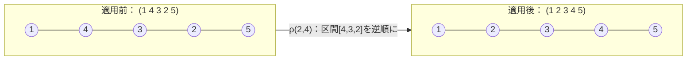
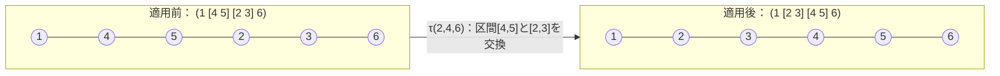
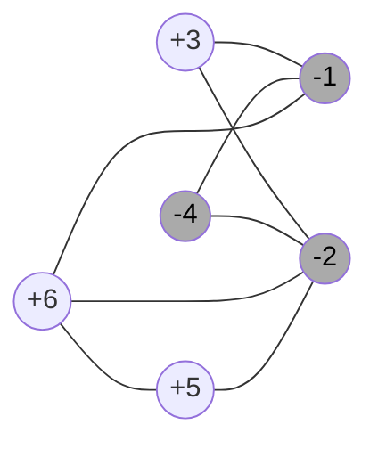

# Sec 2: 共通定義

## 順列

- **符号なし順列** π = (π₁ π₂ … πₙ)：πᵢ ∈ {1,…,n}、すべて異なる
- **符号付き順列** π = (π₁ π₂ … πₙ)：πᵢ ∈ {−n,…,−1,+1,…,+n}、|πᵢ| はすべて異なる
- **恒等順列** ι = (1 2 … n)：ソーティング問題のゴール（符号付きでは全要素が正）

---

## 再配置操作

### 逆位（Reversal）
- **符号なし逆位** ρ(i,j)（1 ≤ i < j ≤ n）：区間 πᵢ…πⱼ を逆順にする  
  π · ρ(i,j) = (π₁…πᵢ₋₁ **πⱼ…πᵢ** πⱼ₊₁…πₙ)
- **符号付き逆位** ρ̄(i,j)（1 ≤ i ≤ j ≤ n）：逆順 + 各要素の符号を反転  
  π · ρ̄(i,j) = (π₁…πᵢ₋₁ **−πⱼ…−πᵢ** πⱼ₊₁…πₙ)
- 長さ：|ρ(i,j)| = |ρ̄(i,j)| = j − i + 1

**例：ρ(2,4) を π = (1 4 3 2 5) に適用**

---

### 転置（Transposition）
- **転置** τ(i,j,k)（1 ≤ i < j < k ≤ n+1）：隣接する2区間を交換（符号変化なし）  
  π · τ(i,j,k) = (π₁…πᵢ₋₁ **πⱼ…πₖ₋₁ πᵢ…πⱼ₋₁** πₖ…πₙ)
- 長さ：|τ(i,j,k)| = k − i

**例：τ(2,4,6) を π = (1 4 5 2 3 6) に適用**

---

### 長さによる分類
| 用語 | 条件 |
|------|------|
| λ-再配置 | \|β\| ≤ λ（λ > 1 は整数） |
| super short | \|β\| ≤ 2 |
| short | \|β\| ≤ 3 |

---

## コスト関数

- 再配置 β のコスト：**f(β) = |β|^α**（α ≥ 0 は実数パラメータ）
- 操作列 S = β₁,…,βₘ のコスト：f(S) = Σ f(βᵢ)
- α = 0 が従来の均一コスト；本論文は主に α = 1 を考察し、Sec 8 で α > 1 も扱う

---

## λ-再配置距離

モデル M（許可する操作の集合）と順列 π に対して：  
**c^M_λ(π)** = M の λ-再配置のみを用いて π を ι に変換する最小コスト

記法：r（符号なし逆位）、r̄（符号付き逆位）、t（転置）、rt（符号なし逆位+転置）、r̄t（符号付き逆位+転置）  
例：cr̄λ(π) = 符号付き逆位の λ-再配置距離

---

## 転倒数（Inversions）

- **転倒 (inversion)**：πᵢ と πⱼ（i < j）で |πᵢ| > |πⱼ| となるペア
- **Inv(π)**：π の転倒数
- Inv(π) = 0 ⟺ |π₁| < |π₂| < … < |πₙ|（符号なし順列では ι のみ）
- **ΔInv(π, β)** = Inv(π) − Inv(π·β)：β による転倒数の変化量

**Lemma 1**：Inv(π) > 0 ならば、隣接する転倒 (πᵢ, πᵢ₊₁) が必ず存在する。

### 順列グラフ G(π)

- 無向グラフ G(π) = (V, E)；V = {π₁,…,πₙ}、E = 転倒ペアの集合
- **符号付き**の場合の追加概念：
  - 連結成分 C が **奇 (odd)**：C 内の負要素数が奇数
  - **c(π)**：連結成分数、**codd(π)**：奇連結成分数
  - **γ(π)**：孤立頂点でない頂点数（少なくとも1つの転倒に属する要素数）
  - **カット辺 (cut-edge)**：削除すると連結成分数が増加する辺

**例：π = (+3 −4 +6 −1 +5 −2) の順列グラフ**（論文 Fig.1）  
c(π) = codd(π) = 1、γ(π) = 6（全頂点が非孤立）、負要素（灰色）が3つ → 奇成分

---

## エントロピー（Entropy）

- 要素 πᵢ のエントロピー：**ent(πᵢ) = | |πᵢ| − i |**（正しい位置からのズレ）
- 順列 π のエントロピー：**ent(π) = Σ ent(πᵢ)**
- ent(π) = 0 ⟺ |π₁| < |π₂| < … < |πₙ|（符号なし順列では ι のみ）
- **Δent(π, β)** = ent(π) − ent(π·β)：β によるエントロピーの変化量

**例：π = (+5 −4 +3 −1 +2) のエントロピー**

| 要素 πᵢ | 位置 i | \|πᵢ\| | ent(πᵢ) = \| \|πᵢ\| − i \| |
|--------|-------|--------|--------------------------|
| +5     | 1     | 5      | \|5−1\| = 4              |
| −4     | 2     | 4      | \|4−2\| = 2              |
| +3     | 3     | 3      | \|3−3\| = 0              |
| −1     | 4     | 1      | \|1−4\| = 3              |
| +2     | 5     | 2      | \|2−5\| = 3              |
| **合計** |      |        | **ent(π) = 12**          |

### 符号付き順列専用の集合

- **E⁻_even**：πᵢ < 0 かつ ent(πᵢ) が偶数である要素の集合
- **E⁺_odd**：πᵢ > 0 かつ ent(πᵢ) が奇数である要素の集合

上の例では E⁻_even = {−4}、E⁺_odd = {+2}

**Lemma 2** (Galvão et al. 2015)：長さ2の符号付き逆位 ρ̄ は |E⁻_even| + |E⁺_odd| を変化させない。
